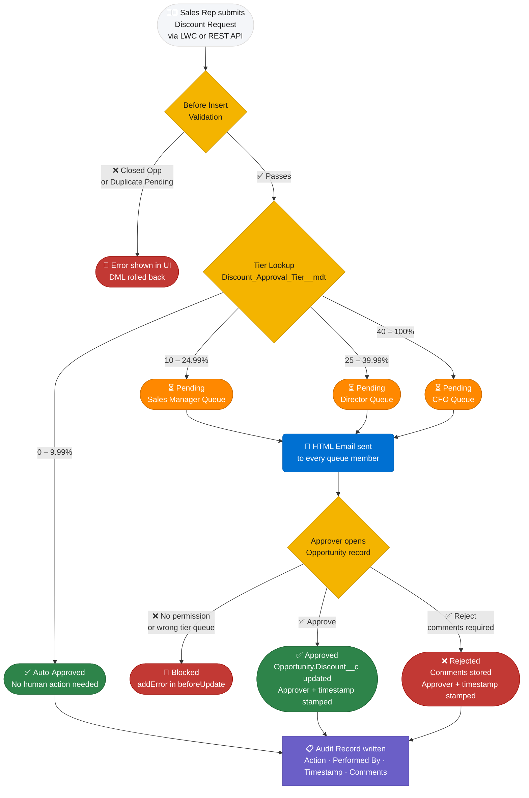

# Intigris Discount Approval System

A Salesforce metadata project that implements a configurable, multi-tier discount approval workflow on the Opportunity object. Sales reps submit discount requests through a Lightning Web Component; the platform routes each request to the correct approver queue based on Custom Metadata tiers, enforces approval rights via a Custom Permission, and writes an immutable audit trail on every state change.

---

## System Flow



---

## Table of Contents

1. [Architecture Decisions & Trade-offs](#1-architecture-decisions--trade-offs)
2. [AI Workflow](#2-ai-workflow)
3. [Edge Cases](#3-edge-cases)
4. [Setup Instructions](#4-setup-instructions)
5. [What I Would Change With More Time](#5-what-i-would-change-with-more-time)

---

## 1. Architecture Decisions & Trade-offs

### Why Custom Metadata over Custom Object for tiers

The discount tier thresholds (0–9.99 % auto-approve, 10–24.99 % Sales Manager, etc.) are stored in `Discount_Approval_Tier__mdt` rather than a regular Custom Object.

| Dimension | Custom Metadata | Custom Object |
|-----------|----------------|---------------|
| Deployment | Included in `package.xml`; moves between orgs with source deploy | Requires data migration scripts or manual re-entry per org |
| Apex access | Queried and cached in static variables; no extra SOQL per request | Same SOQL cost, but no deployment portability |
| Sandbox refresh | Records survive a sandbox refresh | Records are wiped on full sandbox refresh |
| Protection | Can be marked `protected` in a managed package | No equivalent concept |

Custom Metadata records can be updated directly in Salesforce Setup UI without any deployment — admins go to Setup → Custom Metadata Types → Discount Approval Tier → Manage Records and edit thresholds inline. Every record carries standard **Created By**, **Created Date**, **Last Modified By**, and **Last Modified Date** fields, so basic traceability of who changed a tier and when is available out of the box. This makes Custom Metadata the clear choice: deployment portability, sandbox survival, and admin-friendly configuration — with no meaningful downside for this use case.

---

### Why snapshot the approver level at create time

`Required_Approver_Level__c` and `Final_Discount__c` are written to the `Discount_Request__c` record at insertion time and never recalculated.

**Reason:** If an administrator changes the Custom Metadata tier boundaries after a request is already pending, the original routing decision must be preserved. An approver who accepts or rejects a request must see exactly what was asked at submission time — not a retrospectively recalculated value. The snapshot also survives CMDT changes without corrupting historical audit records.

**Trade-off accepted:** A request submitted at 24.9 % before a tier boundary moves to 20 % will still route to Sales Manager even though the new boundary would send it to Director. This is intentional and desirable for audit consistency.

---

### Why Queue-based approval routing

Each tier maps to a Salesforce Queue (`Sales_Manager_Approvals`, `Director_Approvals`, `CFO_Approvals`). The trigger sets `OwnerId` to the resolved Queue Id.

**Benefits:**
- Any member of the queue can action the request — no single point of failure if a manager is on leave.
- Queue membership is managed in Setup with no code changes required.
- Email notifications go to the queue's shared inbox plus every individual member.
- Queue DeveloperNames are stored in Custom Metadata, so routing rules and queue configuration are decoupled.

**Trade-off accepted:** Salesforce queue ownership does not enforce record-level sharing by default. If the org's Opportunity OWD is Private, approvers may not see the parent Opportunity without an explicit sharing rule. This is deferred (see Section 3).

---

### Why Custom Permission for approval rights

`FeatureManagement.checkPermission('Approve_Discount_Request')` is called before any status change to `Approved` or `Rejected` is committed.

**Reason:** Profiles and permission sets control field-level access but do not express business-level capabilities like "this user may approve discounts." A Custom Permission is precisely that concept — a named capability grantable via Permission Set and checkable programmatically without an extra SOQL query.

**Alternative considered:** A custom `Can_Approve_Discounts__c` field on User. Rejected because it bypasses the standard permission framework, cannot be included in a Permission Set Group, and requires an extra SOQL inside the trigger.

---

### Why a separate Audit object over Field History Tracking

`Discount_Request_Audit__c` is an append-only object written by the trigger.

| Dimension | Field History Tracking | Audit Object |
|-----------|----------------------|--------------|
| Retention | 18 months standard | Permanent unless deleted |
| Field type support | Cannot track Long Text Area fields | Any field type, including long text |
| Fields per object | Max 20 tracked fields per object | Unlimited; structured as rows |
| Custom data | Field + old/new value only | Free-form `Comments__c`, `Action__c`, `Performed_By__c` |
| Queryable | Via `FieldHistory` child relationship | Direct SOQL on the object |
| Reportable | Limited; not in all report types | Full Report Builder support |
| Packagable | Configuration only; no metadata file | Full metadata + data portability |

**Key technical constraint:** Two of the most important fields in this system — `Reason__c` (the rep's justification) and `Approver_Comments__c` (the rejection reason) — are Long Text Area fields. Salesforce Field History Tracking explicitly does not support Long Text Area, Rich Text Area, or Multi-Select Picklist fields. This alone rules it out: capturing a rejection without the rejection comment is not a meaningful audit trail.

**Additional constraints that reinforced the decision:**
- Field History is capped at **20 tracked fields per object**. As the object grows (e.g. adding escalation fields), this limit becomes a design constraint.
- Field History retention is **18 months by default**. Finance and compliance teams typically require longer retention; the audit object can be archived or backed up independently.
- Field History records cannot carry a **free-form comment** alongside the change. The audit object stores `Comments__c`, `Action__c`, and `Performed_By__c` together in a single row, making each audit entry self-contained and human-readable.

**Trade-off accepted:** The audit object consumes data storage. At high volume this cost is real; for the current scope it is negligible.

---

## 2. AI Workflow

### 01 — Your Stack

| Tool | Role |
|------|------|
| **Claude Code** (Anthropic, claude-sonnet-4-6) | Primary coding assistant — architecture design, all Apex classes, metadata XML, LWC, test classes, debugging |
| **VS Code + Salesforce Extension Pack** | IDE, org auth, source tracking, deploy via integrated terminal |
| **Salesforce CLI (`sf`)** | Deploy, test run, org management from terminal |
| **GitHub** | Version control and remote repository — all commits, history, and final deliverable hosted at github.com/gunasekhar8686/IntigrisDiscountApprovalSystem |
| **Claude.ai web** | Architecture brainstorming before opening the editor |

Claude Code was used as an in-editor agent — not just for code generation but for iterative reasoning: asking it to explain a design decision, propose alternatives, and then defend the chosen approach. Every generated file was reviewed, deployed to a live org, and tested before being accepted.

---

### 02 — Custom Setup

No custom MCP servers or slash commands were configured for this project. Claude Code's built-in Bash tool was used to run `sf` CLI commands directly from the conversation, making the loop tight: write code → deploy → run tests → diagnose failures → fix — all within a single session without switching tools.

---

### 03 — Concrete Examples

**Example 1 — HTML email notification implementation**

I designed the notification architecture: one bulk `Messaging.sendEmail` call after collecting all recipient addresses across four pre-loop SOQL queries, with `allOrNothing = false` so a single bad address does not roll back the transaction. Once the design was clear, I directed Claude to implement the HTML email body — branded header, structured table (request number, opportunity, discount %, approver level, reason), and a deep-link CTA button pointing to the Opportunity record. Writing clean HTML email markup with inline styles is pure boilerplate. Claude produced a complete, tested template in under a minute; doing it by hand would have taken significantly longer with no added value.

The prompt was:

> *"Implement the HTML email body for the notification. Blue header (#0070d2), table with alternating row shading, a 'Review & Approve Request' button linking to the Opportunity, and a footer saying 'Kind regards, Sales Team'. Use inline styles only — no external CSS."*

The output was used directly with minor wording tweaks.

**Example 2 — FOR UPDATE + WITH USER_MODE incompatibility**

I knew `FOR UPDATE` was the right tool for the concurrency guard — locking existing Pending rows before the duplicate check so two simultaneous inserts cannot both pass. What I used Claude to validate was a specific platform constraint: `WITH USER_MODE` (enforcing FLS and sharing in SOQL) is **incompatible with `FOR UPDATE`** in Salesforce — combining them throws a runtime error. The prompt was:

> *"I want to use both WITH USER_MODE and FOR UPDATE on this query. Is that valid?"*

Claude confirmed the incompatibility and explained why — `FOR UPDATE` operates at the database lock level before the sharing engine runs, making the combination unsupported. This saved a runtime failure in the org and is the kind of edge case worth explicitly documenting in code comments.

---

### 04 — Where I Overrode the AI

**Custom Metadata vs Custom Object for tiers**

Claude's first suggestion was a Custom Object with standard CRUD access so admins could edit thresholds directly in a list view. Both options allow UI edits without a deployment — so that was not the deciding factor. The override was based on two things Custom Object cannot match: CMDT records travel with the package during sandbox-to-production deployments with no separate data migration step, and they survive a full sandbox refresh without being wiped. Custom Metadata also carries standard Created By and Last Modified By fields, so basic traceability is available. For this use case, Custom Metadata wins on every dimension that matters.

**Flow vs Apex for email notifications**

Claude initially generated a Record-Triggered Flow to send approval notification emails. Two problems emerged during review and testing:

1. **SOQL inside a loop** — the Flow looped over every `GroupMember` record and issued a separate Get Records element inside the loop to look up each member's email address. In a queue with 10 members that is 10 SOQL queries; in a bulk insert of 200 requests across multiple queues this becomes a governor limit violation. Flow has no native way to collect all member IDs first and resolve emails in a single query.

2. **Missing fault connector** — without a fault path on the `emailSimple` action, any email failure (invalid address, deliverability disabled) caused the entire record-save transaction to roll back. The Discount Request was never created.

Rather than patching both issues in Flow — which has no bulk-collection pattern and requires manually wiring fault connectors on every action — the decision was made to replace it entirely with the Apex `sendQueueNotifications` method. Apex resolves all member emails in a single `SELECT Id, Email FROM User WHERE Id IN :memberUserIds` query outside any loop, builds the full `List<Messaging.SingleEmailMessage>` in memory, and calls `Messaging.sendEmail(emails, false)` once. The `allOrNothing = false` flag means a single bad address is skipped without affecting the rest. The flow was deactivated and kept in the repo as a reference of the original approach.

---

### 05 — Where It Broke Down

- **Deployment verification:** Claude cannot connect to a Salesforce org, run `sf project deploy`, or confirm that generated metadata XML is valid against the live Metadata API. Every XML file required a test deploy to catch issues such as missing required elements or incorrect operator names in Flow filters.
- **Org-specific values:** Queue email addresses, profile names for test users, and Custom Metadata DeveloperNames must match what exists in the target org. Claude generated plausible values; each had to be verified against the actual org before tests passed.
- **AuraHandledException in test context:** Claude initially wrote a test that asserted on the exception message from `AuraHandledException`. In practice, when thrown from a trigger, Salesforce obscures the message as `"Script-thrown exception"` at the test layer. Claude flagged this as a known issue only after the test failed — the fix was to assert on record state instead of exception message.
- **No UI or inbox visibility:** Claude Code can run SOQL queries and retrieve Apex debug logs via the SF CLI — those were genuinely useful during debugging. What it cannot do is see what is rendered on screen in the browser, browse Setup pages visually, or access external inboxes. A real example from this project: emails were sending successfully (confirmed via debug logs and `Messaging.sendEmail` returning no errors) but were landing in Gmail spam. That required opening the inbox manually to diagnose — nothing in the org or logs pointed to it.

---

## 3. Edge Cases

### Handled

| Scenario | Implementation |
|----------|---------------|
| **Closed Won / Closed Lost opportunity** | Before-insert trigger queries `Opportunity.IsClosed` — covers all closed stages, not just named ones. The insert fails with a user-readable error. |
| **Concurrent duplicate Pending requests** | `FOR UPDATE` SOQL on existing Pending records acquires a row-level lock before the duplicate check. Two simultaneous inserts cannot both pass the guard. |
| **Stacked discounts** | On each new approval, prior Approved/Auto-Approved requests have `Is_Active__c` set to `false` and `Opportunity.Discount__c` is overwritten with the latest `Final_Discount__c`. The newest approval always wins. |
| **Unauthorised approval attempt** | `FeatureManagement.checkPermission('Approve_Discount_Request')` is enforced server-side in the trigger, not just in the LWC. A user without the permission cannot approve via LWC, API, Workbench, or Data Loader. |

### Deferred

| Scenario | Reason deferred |
|----------|----------------|
| **Multi-currency** | Discount values are percentages, not currency amounts. `Opportunity.Discount__c` is a Number(5,2) field. Multi-currency has no bearing on the tier thresholds or workflow. |
| **Auto-escalation** | Pending requests older than N days should auto-escalate to the next tier. Deferred to stretch goal — implementation would be a Scheduled Apex job querying overdue Pending requests. |

---

## 4. Setup Instructions

### Prerequisites

- Salesforce CLI (`sf`) installed and up to date.
- VS Code with the Salesforce Extension Pack.
- A target org already provisioned (Developer Edition or Sandbox).

### Steps

**1. Clone the repository**

```bash
git clone https://github.com/gunasekhar8686/IntigrisDiscountApprovalSystem.git
cd IntigrisDiscountApprovalSystem
```

**2. Authenticate to your org**

```bash
sf org login web --alias MyOrg
```

**3. Deploy all metadata**

```bash
sf project deploy start --target-org MyOrg --manifest manifest/package.xml
```

**4. Run Apex tests**

```bash
sf apex run test --target-org MyOrg --class-names DiscountRequestTest,DiscountRequestAPITest --result-format human --wait 10
```

**5. Assign Permission Sets**

```bash
# Sales reps — can submit requests
sf org assign permset --name Discount_Requester --on-behalf-of <username> --target-org MyOrg

# Managers / Directors / CFO — can approve and reject
sf org assign permset --name Discount_Approver --on-behalf-of <username> --target-org MyOrg
```

**6. Add users to Queues**

Navigate to **Setup → Queues** and add the appropriate users to:
- `Sales Manager Approvals`
- `Director Approvals`
- `CFO Approvals`

**7. Verify Custom Metadata tier records**

**Setup → Custom Metadata Types → Discount Approval Tier → Manage Records** — confirm four records: Auto Approve (0–9.99 %), Sales Manager (10–24.99 %), Director (25–39.99 %), CFO (40–100 %).

**8. Add the LWC to the Opportunity page**

Any Opportunity → gear icon → **Edit Page** → drag **Discount Request Panel** onto the layout → **Save and Activate**.

---

### Stretch Goal — Apex REST API

An `@RestResource` endpoint is exposed at `/services/apexrest/discount-requests/v1` so external systems (ERP, CPQ tools, integrations) can create Discount Requests programmatically without a Salesforce UI. The same trigger logic runs on insert — tier routing, auto-approve, duplicate guard, and email notifications all fire exactly as they do from the LWC.

**Endpoint:** `POST /services/apexrest/discount-requests/v1`

**Request body:**
```json
{
  "opportunityId": "<Opportunity Id>",
  "discount": 15,
  "reason": "Strategic deal — competitive pricing."
}
```

**Response codes:**
- `201` — request created; returns `requestId`, `requestName`, and `status` (Pending or Auto-Approved)
- `400` — validation failure (missing fields, discount out of range, closed opportunity, duplicate pending)
- `500` — unexpected server error

**Input validation enforced by the endpoint:**
- `opportunityId` is required
- `discount` must be a number between 0 and 100

All business validation (closed opportunity, duplicate pending) is enforced by the existing trigger and surfaces as a `400` with a clear message.

**Test with curl:**

```bash
# Get an access token
sf org display --target-org MyOrg

# Create a discount request
curl -s -w "\n%{http_code}" -X POST \
  'https://<your-org-domain>/services/apexrest/discount-requests/v1' \
  -H 'Authorization: Bearer <access_token>' \
  -H 'Content-Type: application/json' \
  -d '{"opportunityId":"<opp_id>","discount":15,"reason":"Strategic deal — competitive pricing."}'

# Success response (201)
# { "status": "Pending", "requestName": "DR-0001", "requestId": "a00...", "message": "Discount request created successfully." }

# Validation error response (400)
# { "status": null, "requestName": null, "requestId": null, "message": "Cannot create discount request on closed Opportunities." }
```

---

## 5. What I Would Change With More Time

### Auto-escalation (Stretch Goal 01)

A Scheduled Apex job querying Pending requests older than N business days and escalating `OwnerId` to the next tier queue, with an audit record for the escalation. This prevents requests from silently stalling when an approver is on leave.

### Org-wide Approvals Queue LWC (Stretch Goal 02)

A second LWC component targeting `lightning__AppPage` that shows all Pending discount requests across all Opportunities. Approvers currently navigate to individual Opportunity records. A centralised view with bulk approve/reject would significantly improve approver productivity.

### Jest LWC tests (Stretch Goal 04)

Jest unit tests for `discountRequestPanel` covering: empty state rendering, badge colour per status, button visibility by permission, and inline form validation. Currently the LWC is covered by manual testing only.

### Additional improvements

| Area | Change |
|------|--------|
| **Submitter notifications** | Currently only the approver queue is notified. The rep who submitted the request receives no email when it is Approved or Rejected. Adding an after-update notification to `CreatedById` would close the feedback loop — the rep would know immediately when their discount was actioned and whether they can proceed with the deal. |
| **Apex Managed Sharing** | Write sharing records on `Discount_Request__c` insert to grant queue members read access to the parent Opportunity when OWD is Private. |
| **Platform Events** | Publish a `Discount_Decision__e` Platform Event on approval/rejection so external subscribers (ERP, Slack) receive real-time notifications without polling. |
| **Duplicate check UX** | Show the existing Pending request's record link in the LWC message so the rep can navigate directly to it instead of receiving only a toast error. |
| **Connected App + JWT auth for REST API** | Replace session-token-based curl demos with a proper OAuth 2.0 JWT Bearer flow for server-to-server external system integration. |

---

## Project Structure

```
IntigrisDiscountApprovalSystem/
├── manifest/
│   └── package.xml
├── force-app/main/default/
│   ├── classes/
│   │   ├── DiscountTierSelector.cls          # Custom Metadata query + queue ID resolution (cached)
│   │   ├── DiscountRequestService.cls        # Core business logic (before/after insert, before/after update)
│   │   ├── DiscountRequestHandler.cls        # Thin trigger handler; owns isProcessingApproval flag
│   │   ├── DiscountRequestController.cls     # @AuraEnabled methods for the LWC
│   │   ├── DiscountRequestAPI.cls       # @RestResource POST /discount-requests/v1
│   │   ├── DiscountRequestTest.cls           # 20 Apex tests (trigger + controller)
│   │   └── DiscountRequestAPITest.cls   # 5 Apex tests (REST endpoint)
│   ├── triggers/
│   │   └── DiscountRequestTrigger.trigger
│   ├── lwc/
│   │   └── discountRequestPanel/
│   ├── objects/
│   │   ├── Discount_Request__c/
│   │   ├── Discount_Request_Audit__c/
│   │   ├── Discount_Approval_Tier__mdt/
│   │   └── Opportunity/fields/Discount__c.field-meta.xml
│   ├── customMetadata/                       # 4 tier records
│   ├── customPermissions/                    # Approve_Discount_Request, Submit_Discount_Request
│   ├── permissionsets/                       # Discount_Approver, Discount_Requester
│   ├── queues/                               # Sales_Manager_Approvals, Director_Approvals, CFO_Approvals
│   └── flows/                               # Discount_Request_Approval_Notification (deactivated)
└── sfdx-project.json
```

---

*Built by Guna Sekhar P. — Intigris Senior Salesforce Developer Take-Home Case, April 2026*
